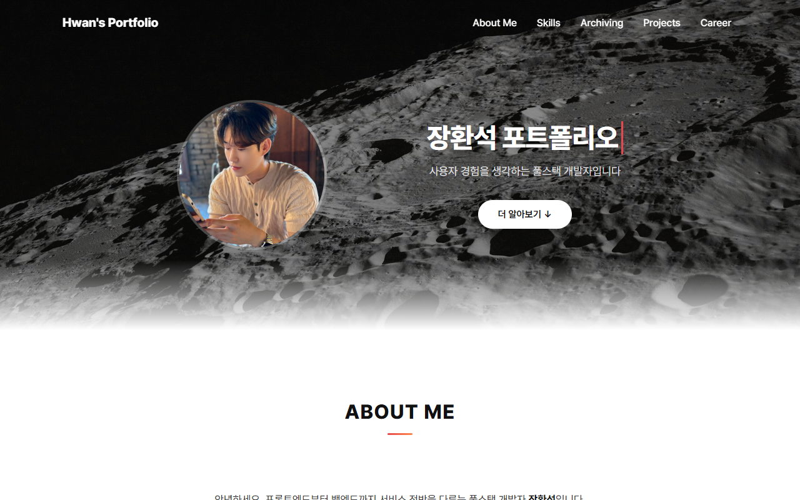

# Hwan's Portfolio 🙋‍♂️

사용자 경험을 생각하는 풀스택 개발자 **장환석**의 포트폴리오 웹사이트입니다.

**🔗 바로가기**: https://hwan1002.github.io/Portfolio/



## 섹션 구성

| 섹션 | 내용 |
|------|------|
| **About Me** | 소개와 기본 정보 |
| **Skills** | 사용 가능한 기술 스택 |
| **Career** | 경력 사항 |
| **Archiving** | GitHub 등 개발 기록 아카이브 링크 |
| **Projects** | 프로젝트 카드 — 기획서(PDF)·데모 링크·GitHub·README 모달 제공 |

## 주요 구현 포인트

- **README 모달 뷰어** — 프로젝트 카드의 README 버튼을 누르면 `react-markdown` + `remark-gfm` + `rehype-raw`로 마크다운을 모달에 렌더링합니다. 각 프로젝트 저장소의 **GitHub raw URL을 실시간으로 fetch**하기 때문에, 프로젝트 저장소의 README가 갱신되면 포트폴리오를 재배포하지 않아도 항상 최신 내용이 보입니다.
- **모달 UX** — ESC 키/배경 클릭으로 닫기, 모달이 열린 동안 배경 스크롤 잠금.
- **타이핑 효과 히어로** — 메인 타이틀에 커서 애니메이션이 있는 타이핑 연출.
- **스크롤 내비게이션** — 상단 메뉴로 각 섹션 이동, 스크롤 시 '맨 위로' 버튼 표시.
- **gh-pages 자동 배포** — `npm run deploy` 한 번으로 빌드부터 GitHub Pages 배포까지 완료.

## 기술 스택


- React 19 (Create React App)
- react-markdown / remark-gfm / rehype-raw — README 모달 렌더링
- gh-pages — GitHub Pages 배포

## 실행 & 배포

```bash
# 개발 서버 (http://localhost:3000)
npm install
npm start

# GitHub Pages 배포 (빌드 + 배포)
npm run deploy
```

## 프로젝트 구조

```
src/
├── App.js
├── component/
│   ├── Header.js          # 상단 내비게이션
│   ├── About.js           # About Me 섹션
│   ├── Skills.js          # 기술 스택 섹션
│   ├── Career.js          # 경력 섹션
│   ├── Archiving.js       # 아카이브 링크 섹션
│   ├── Project.js         # 프로젝트 카드 + README 모달
│   ├── ProfilePhoto.js    # 프로필 사진
│   ├── ScrollTopButton.js # 맨 위로 버튼
│   └── Footer.js
└── css/                   # 스타일 및 이미지 리소스
```

## 소개된 프로젝트

- **Masil** — 이웃 간 물품 렌탈 플랫폼 (React, Spring Boot, WebSocket, OAuth2)
- **IT Trip** — 여행 계획 관리 서비스 (React, Spring Boot, AWS)
- **Movie (HWANFLIX)** — 바닐라 JS 영화 검색 & 즐겨찾기 ([데모](https://hwan1002.github.io/movie/))
- **IWC 리뉴얼** — 반응형 웹사이트 (HTML, CSS, jQuery)
