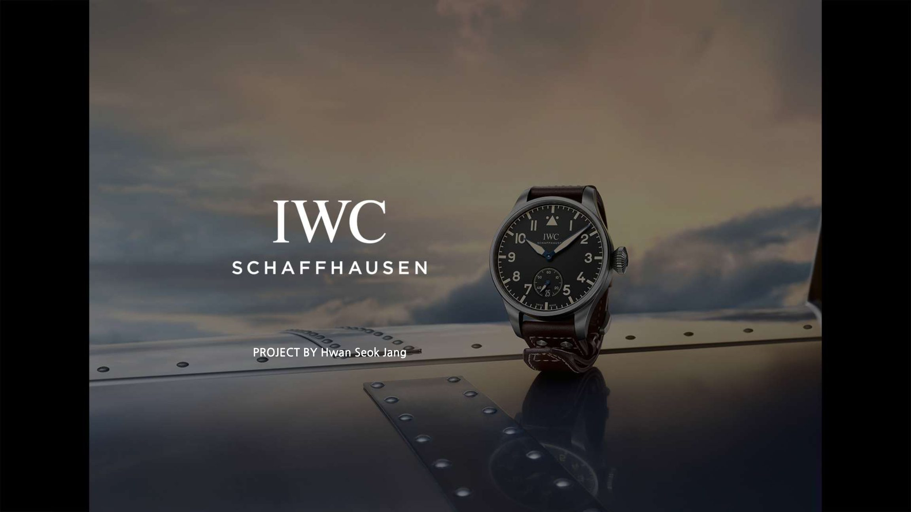
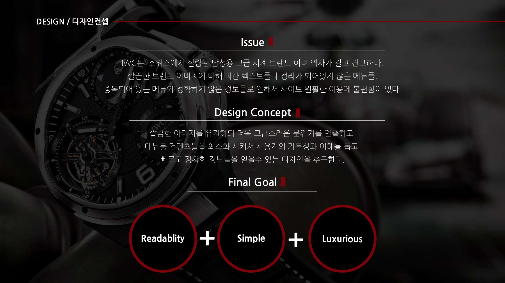
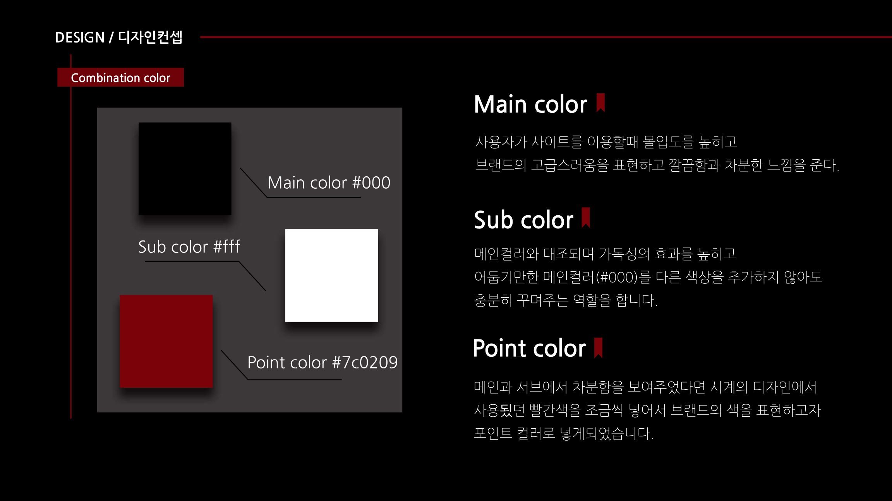
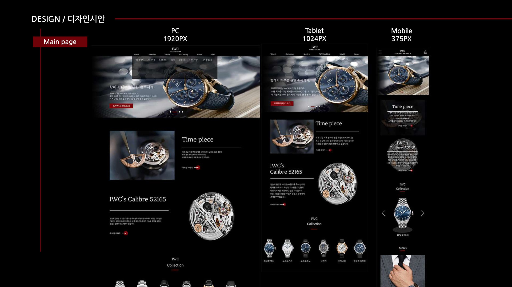
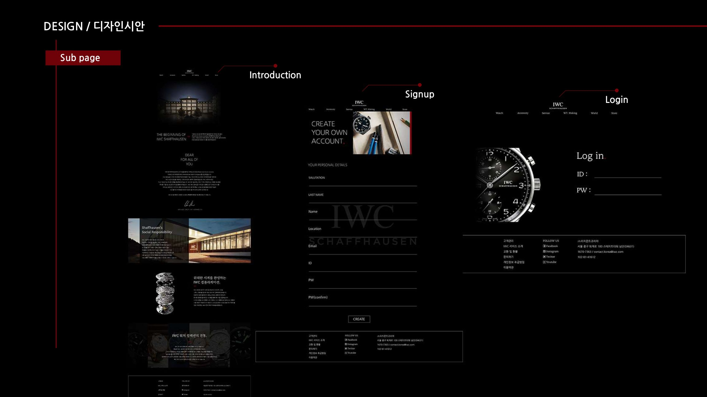
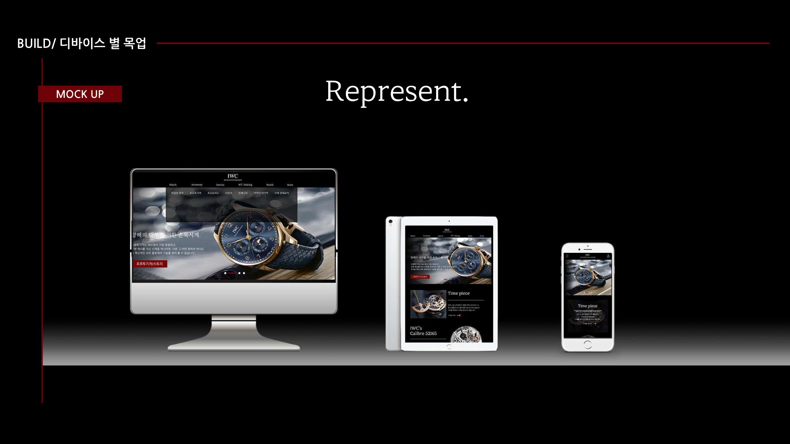

<h1>IWC Renewal Project</h1>

    

 
<h4 style="color:black; background-color:white; margin:0; padding:0;">스위스 명품 시계 브랜드 IWC 공식 사이트 리뉴얼 !</h4> 

<b>⌚ 브랜드 사이트 리뉴얼 &amp; 반응형 웹 프로젝트</b> 

 1868년 설립된 스위스 명품 시계 브랜드 IWC(International Watch Company)의 공식 사이트를 분석하고, 
 기획 → 분석 → 디자인 → 개발까지 전 과정을 직접 수행한 리뉴얼 프로젝트입니다. 
 PC · Tablet · Mobile 3가지 디바이스에 대응하는 반응형 웹사이트로 구현했습니다.

 

<h4 style="color:black; background-color:white; margin:0; padding:0;">
    프로젝트 개요
</h4>

  진행 기간 : 2021.06 ~ 2021.11 (개인 프로젝트) 
  진행 과정 : 자사·경쟁사 분석(SWOT) → 기존 사이트 문제점 분석 → 디자인 트렌드 벤치마킹 → 디자인 컨셉 도출 → 와이어프레임 → 시안 → 개발

 

<h4 style="color:black; background-color:white; margin:0; padding:0;">🔍 기존 사이트 분석</h4>

<b>"브랜드의 가치에 비해 아쉬웠던 공식 사이트"</b> 
<ul>
    <li>네비게이션의 다빈치 메뉴가 404(Not Found)로 연결되는 <b>링크 오류</b></li>
    <li>서비스 센터 찾기와 스토어 검색이 동일한 결과를 보여주는 <b>중복 메뉴</b></li>
    <li>슬라이드 없이 사진 한 장만 보여주는 단조로운 메인 비주얼과 <b>낭비되는 서브메뉴 공간</b></li>
    <li>오데마 피게 · 파텍 필립 · 리차드밀 등 경쟁 브랜드 사이트를 벤치마킹하여 개선 방향 도출</li>
</ul>

<b>🎨 디자인 컨셉 — Readability + Simple + Luxurious</b>

    

  <ul>
    <li>깔끔한 이미지를 유지하되 더욱 고급스러운 분위기를 연출</li>
    <li>메뉴 등 컨텐츠를 최소화하여 사용자의 가독성과 이해를 돕는 디자인</li>
  </ul>

 

    

  <ul>
    <li>Main <b>#000</b> · Sub <b>#fff</b> · Point <b>#7c0209</b> — 시계 디자인에 쓰인 붉은색을 포인트 컬러로 활용</li>
    <li>본문은 나눔고딕, 타이틀은 마루부리 폰트로 고급스러운 분위기 연출</li>
  </ul>

 

<b>📱 반응형 디자인 (PC 1920 · Tablet 1024 · Mobile 375)</b>

    

  <ul>
    <li>디바이스별 해상도에 맞춰 메인 비주얼 슬라이드, 컬렉션, 컨텐츠 배치를 최적화</li>
    <li>스크롤에 따라 컨텐츠가 소개되는 인터랙션으로 보는 재미를 높임</li>
  </ul>

 

<b>📄 서브 페이지</b>

    

  <ul>
    <li>브랜드 소개(Introduction) · 회원가입(Signup) · 로그인(Login) 페이지 구현</li>
  </ul>

 

<b>🖥️ 최종 결과물</b>

    

<h1>
    <b>🛠️Tech Stack</b>
</h1>

  <b>Frontend</b> : HTML, CSS, JavaScript, jQuery 
  <b>Design</b> : Photoshop, Illustrator (와이어프레임 · 시안 · 목업 제작)

 

<b>✨ 클래식은 그대로, 경험은 새롭게 — IWC Renewal !
</b>
