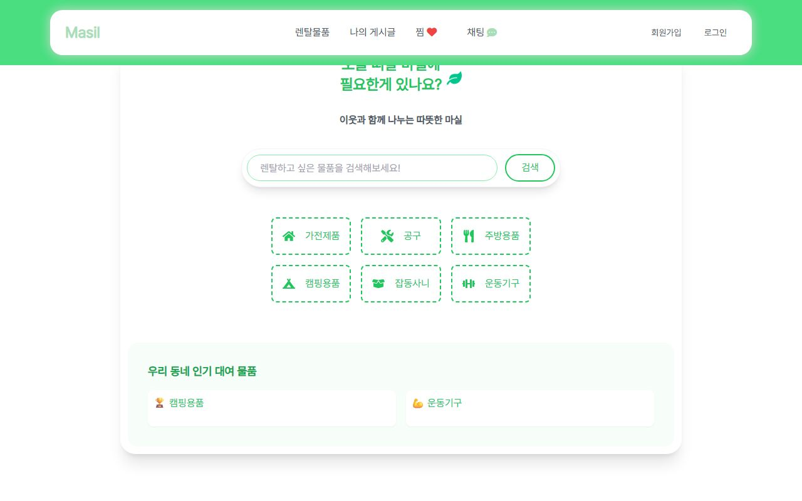
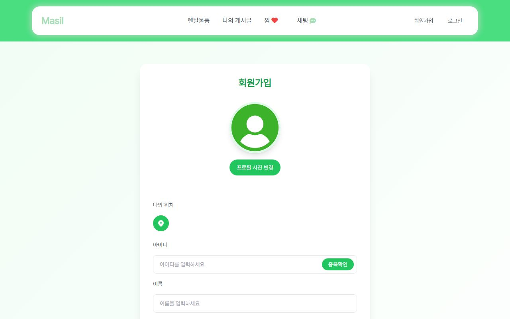

<h1>Masil Service</h1>

    

 
<h4 style="color:black; background-color:white; margin:0; padding:0;">이웃과 함께 나누는 따뜻한 마실 !</h4> 

<b>📦 이웃 간 물품 렌탈 플랫폼</b> 

 쓰지 않는 물건은 빌려주고, 필요한 물건은 가까운 이웃에게 빌려 쓰는 렌탈 마켓 서비스입니다.  
 물품 등록부터 위치 기반 검색, 실시간 채팅까지 대여의 전 과정을 한곳에서 해결할 수 있습니다.

 

<h4 style="color:black; background-color:white; margin:0; padding:0;">
    기능 요약
</h4>

  비로그인 상태 : 검색과 카테고리로 등록된 렌탈 물품을 둘러볼 수 있습니다. 
  로그인 후 사용 가능 기능 : 물품 등록, 찜, 실시간 채팅으로 대여 약속까지 진행할 수 있습니다.

 

    <a href="https://github.com/Hwan1002/masil" target="_blank" rel="noopener noreferrer">
        🔗 Masil GitHub 저장소 보러가기</a>

 

<h4 style="color:black; background-color:white; margin:0; padding:0;">🚀 프로젝트 소개</h4>

<b>🏠 메인 페이지
</b>

    <video src="readme-video/masil-main.mp4" autoplay muted loop playsinline></video>

<b>
    "오늘 뭐 할까, 마실에 필요한 게 있나요?"</b> 
<ul>
    <li>검색창과 카테고리(가전제품 · 공구 · 주방용품 · 캠핑용품 · 잡동사니 · 운동기구)로 원하는 물품을 바로 찾을 수 있습니다.</li>
    <li>우리 동네 인기 대여 물품을 메인 화면에서 한눈에 확인할 수 있습니다.</li>
</ul>

<b>🔐 회원가입 / 로그인
</b>

    <video src="readme-video/masil-login.mp4" autoplay muted loop playsinline></video>

  <h4 style="color:black; background-color:white; margin:0; padding:0;">"간편하고 안전한 로그인!"</h4>
  <ul>
    <li>JWT(AccessToken / RefreshToken) 기반 인증으로 안전하게 로그인 상태를 유지합니다.</li>
    <li>카카오 · 구글 · 네이버 OAuth2 소셜 로그인을 지원합니다.</li>
    <li>이메일 인증과 아이디 / 비밀번호 찾기 기능을 제공합니다.</li>
  </ul>

 

    

  <ul>
    <li>회원가입 시 프로필 사진과 <b>나의 위치</b>를 등록해 동네 기반 서비스를 이용할 준비를 합니다.</li>
  </ul>

 

<b>📍 위치 기반 렌탈 물품</b>

    <video src="readme-video/masil-item.mp4" autoplay muted loop playsinline></video>

  <ul>
    <li>등록한 위치를 기준으로 <b>근처 5km 이내</b>의 렌탈 물품을 조회할 수 있습니다.</li>
    <li>물품 등록 시 여러 장의 사진과 위치 정보를 함께 저장합니다.</li>
    <li>마음에 드는 물품은 찜(❤)해두고 모아볼 수 있습니다.</li>
  </ul>

 

<b>💬 실시간 채팅</b>

    <video src="readme-video/masil-chat.mp4" autoplay muted loop playsinline></video>

  <h4 style="color:black; background-color:white; margin:0; padding:0;">"이웃과 실시간으로 대여 약속을 잡아보세요!"</h4>
  <ul>
    <li>WebSocket 기반 <b>1:1 실시간 채팅</b>으로 빌리는 사람과 빌려주는 사람이 바로 대화할 수 있습니다.</li>
    <li>메시지 읽음 처리와 안 읽은 메시지 뱃지로 대화 상태를 놓치지 않습니다.</li>
    <li>낙관적 업데이트를 적용해 전송 즉시 메시지가 화면에 반영됩니다.</li>
  </ul>

<h1>
    <b>🛠️Tech Stack</b>
</h1>

  <b>Frontend</b> : React, React Router, Zustand, MUI, Axios 
  <b>Backend</b> : Java 17, Spring Boot, Spring Security, JPA, WebSocket, JWT, OAuth2 
  <b>Database</b> : MySQL

 

<b>✨ 필요한 물건, 사지 말고 이웃과 나눠 쓰세요 — Masil !
</b>
