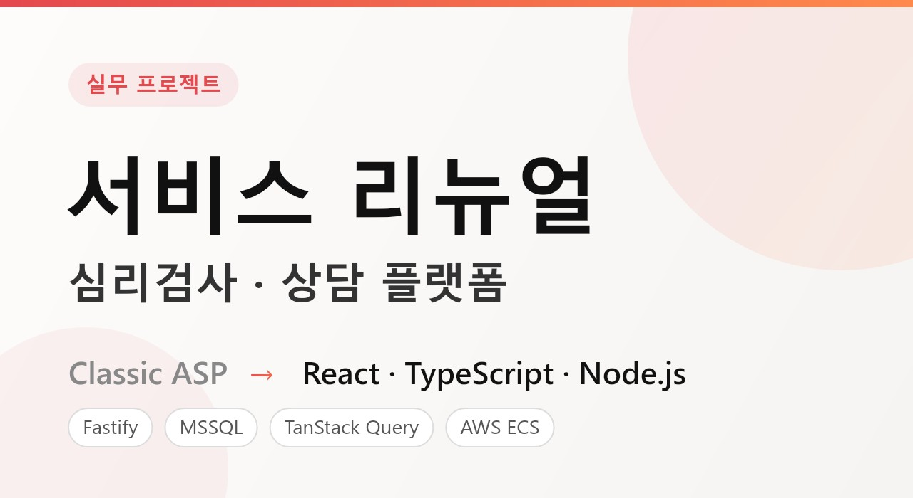

<h1>심리검사·상담 서비스 리뉴얼</h1>

    

 
<h4 style="color:black; background-color:white; margin:0; padding:0;">레거시를 멈추지 않고, 새 스택으로 갈아타기 !</h4> 

<b>🏢 심리검사·상담 서비스의 레거시 시스템 현대화 (실무)</b> 

 심리검사·상담 서비스의 운영 시스템은 오랫동안 Classic ASP로 운영되어 왔습니다. 
 서비스를 멈추지 않은 채, 워크샵 관리 시스템과 관리자 백엔드를
 <b>React · TypeScript · Node.js(Fastify)</b> 스택으로 점진적으로 이관하는 프로젝트에
 주력 개발자로 참여하고 있습니다.

 

<h4 style="color:black; background-color:white; margin:0; padding:0;">
    이 프로젝트가 어려운 이유
</h4>

  운영 중인 시스템의 리뉴얼은 "새로 만들기"가 아니라 <b>"동작을 보존하며 옮기기"</b>입니다. 
  기존 ASP와 새 시스템이 한동안 공존하기 때문에, 두 시스템의 처리 결과가
  항상 일치해야 하고(정합성 유지), 파일 처리처럼 아직 이관되지 않은 기능은
  레거시 ASP 엔드포인트와 병행 연동해야 합니다.

 

<h4 style="color:black; background-color:white; margin:0; padding:0;">🖥️ 워크샵 관리 시스템 리뉴얼 — Frontend</h4>

<b>"Classic ASP 화면을 React 19 + TypeScript 웹앱으로"</b> 
<ul>
    <li>교육(워크샵) 개설·관리, 강사 등록·승인, 수강생 관리를 담당하는 기관용 웹앱</li>
    <li><b>강사 등록·인증·승인 플로우</b> 전반을 신규 개발 — 자격증 기반 워크샵 종류 자동 동기화, 승인 상태별 분기 처리</li>
    <li>수강생 <b>엑셀 일괄 등록</b> 기능과 휴대폰번호 중복 등 데이터 검증 로직 구현</li>
    <li>회원가입 이메일 인증 플로우(중복 요청 방지, 기관명 검증)와 활동 내역 로그 화면 개발</li>
    <li>TanStack Query 커스텀 훅으로 서버 상태·페이지네이션을 표준화하고, 도메인별 feature 단위(api/useForm/ui)로 구조화</li>
    <li>파일 업로드 등 미이관 기능은 레거시 ASP와 프록시로 병행 연동 (점진적 마이그레이션)</li>
</ul>

 

<h4 style="color:black; background-color:white; margin:0; padding:0;">⚙️ 관리자 백엔드 API — Backend</h4>

<b>"ASP 관리자 페이지의 로직을 Fastify API로, 결과는 완전히 동일하게"</b> 
<ul>
    <li>주문·배송, 발주, 회원, 정산, 견적, 메시지 발송 등 운영 전반의 API 개발</li>
    <li>결제 · ERP · 문자/메일 발송 등 <b>다수의 외부 시스템 연동</b> 및 운영 이슈 대응</li>
    <li>MSSQL 커넥션 풀과 트랜잭션 기반으로 대량 일괄처리 로직 구현</li>
</ul>

 

<h4 style="color:black; background-color:white; margin:0; padding:0;">🔧 이런 문제들을 해결했습니다</h4>

  <ul>
    <li>대량 일괄처리에서 발생하던 <b>타임아웃 문제</b>를 DB 트랜잭션 구조 개선으로 해결</li>
    <li>레거시와 신규 시스템 간 <b>처리 결과 불일치</b>를 추적해 정합성 복구</li>
    <li>외부 연동 API의 <b>정책 변경·지원 종료</b>에 무중단으로 대응</li>
    <li>외부 API 호출 제한(레이트리밋)에 <b>재시도·백오프</b> 로직으로 안정화</li>
  </ul>

 

<h1>
    <b>🛠️Tech Stack</b>
</h1>

  <b>Frontend</b> : React 19, TypeScript, Vite, TanStack Query, Zustand, Tailwind CSS 
  <b>Backend</b> : Node.js, Fastify, JWT, MSSQL, PostgreSQL 
  <b>Infra / 협업</b> : Docker + GitHub Actions + AWS ECS(Fargate) 자동 배포 환경, AWS S3, Git 기반 코드리뷰

 

  ※ 사내 시스템 특성상 화면과 저장소는 공개할 수 없습니다.

 

<b>✨ 멈추지 않는 서비스 위에서, 레거시를 미래로 !
</b>
